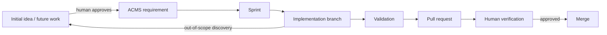

# AgentifyMe Cloud Management System (ACMS)

ACMS is Startup Teams' internal control plane for orchestrating AI agents. It assigns and tracks approved work, preserves context and audit history, supports human steering, and relates agent activity to cost and project progress.

ACMS does **not** instantiate AI agents or directly manage model-serving infrastructure. Agent instantiation, model hosting, and inference infrastructure are owned by LLM Manager and related infrastructure services.

## Core principles

- Centralized governance, decentralized execution.
- One persistent ACMS identity per registered agent.
- One primary ACMS work assignment per agent, plus zero or more known background routines.
- Agent2Agent (A2A) is the preferred semantic protocol foundation.
- A standardized ACMS Agent Bridge adapts Hermes, Pi, Codex, and future harnesses.
- Significant semantic events are durable; token-level streaming may remain ephemeral.
- Markdown is the initial durable format for requirements, context, plans, handoffs, and decisions.
- Human approval is required for scope expansion, protected-context changes, production deployment, credential/permission changes, destructive infrastructure actions, and budget overruns.
- Internal and external/customer agents are separate trust domains.

## Source of truth

| File | Purpose |
|---|---|
| `REQUIREMENTS.md` | Approved ACMS scope. |
| `FUTURE_WORK.md` | Deferred/unapproved ACMS capabilities. |
| `INITIAL_IDEAS.md` | Source-derived research and provenance. |
| `SPRINT.md` | Current execution plan. |
| `docs/BUSINESS_PROBLEMS.md` | Problems ACMS exists to solve. |
| `docs/ARCHITECTURE.md` | Architecture intentions and runtime model. |
| `docs/LLM_MANAGER_DIRECTION.md` | Delegated direction for LLM Manager. |
| `docs/FIRST_EXECUTION_PLAN.md` | First implementation sequence and PR workflow. |
| `docs/adr/` | Durable human-visible architecture decisions. |
| `docs/tdr/` | Accepted technical debt. |
| `AGENTS.md` | Agent operating rules. |

## Requirement model

Approved scope uses permanent IDs `ACMS-REQ-###`.

Research ideas retain source IDs such as `WAT-REQ-###`, `CLDGIT-REQ-###`, `AGENTOS-REQ-###`, `HUB-REQ-###`, and `CREWAI-REQ-###` for provenance only.

Priority:
- **3:** core and approved for the first product baseline.
- **2:** future capability needed for some features.
- **1:** low-priority/extra future capability.

## Development setup

Backend stack (ADR-0007): Python 3.12+, FastAPI, SQLAlchemy 2.x async, PostgreSQL (`asyncpg`), Alembic.

```bash
python3.12 -m venv .venv && source .venv/bin/activate
pip install -e '.[dev]'

# PostgreSQL: either Docker Compose...
export ACMS_POSTGRES_PASSWORD='<set a local dev password>'
docker compose up -d postgres
# ...or, with no Docker/root, an embedded PostgreSQL 16 (dev fallback):
#   python -m pgserver init /tmp/acms-pgdata && python -m pgserver start /tmp/acms-pgdata

cp .env.example .env   # set ACMS_ADMIN_TOKEN and ACMS_DATABASE_URL
alembic upgrade head   # Alembic owns schema; the app never creates tables
uvicorn acms.main:app --reload
```

`ACMS_DATABASE_URL` accepts plain `postgresql://` URLs (auto-normalized to `postgresql+asyncpg://`). SQLite unit tests use `aiosqlite`; PostgreSQL integration tests skip cleanly when no server is available (or set `ACMS_TEST_POSTGRES_URL`).

## Internal web UI (ADR-0008, first live deployment)

The app serves a thin server-rendered UI under `/ui/` (Jinja2, ADR-0008):

- `/ui/login` — LLDAP-backed human login (Administrator / Worker / Observer via configurable group DNs; unmapped users are denied).
- `/ui/`, `/ui/agents`, `/ui/system` — read views over real backend data only (missing fleet fields are labeled, never fabricated).
- Session: signed server-side cookie (`HttpOnly`, `SameSite=Lax`, `Secure` under HTTPS); the UI is disabled unless `ACMS_SESSION_SECRET` is set (fail closed).
- Machine/API traffic keeps the `ACMS_ADMIN_TOKEN` bearer token; it is never shared with the browser.

Local UI dev variables (all optional; UI login stays disabled without `ACMS_SESSION_SECRET` + `ACMS_LDAP_URL`):

```bash
ACMS_SESSION_SECRET='<random secret>'
ACMS_LDAP_URL=ldaps://lldap.miam.home.arpa:636
ACMS_LDAP_USER_BASE=ou=people,dc=miam,dc=home,dc=arpa
ACMS_LDAP_GROUP_ADMIN='<admin group DN>'
ACMS_LDAP_GROUP_WORKER='<worker group DN>'
ACMS_LDAP_GROUP_OBSERVER='<observer group DN>'
```

First live VM deployment (Docker Compose + nginx HTTPS + operator scripts) is documented in [`deploy/README.md`](deploy/README.md).

Full PostgreSQL stack validation (clean database → Alembic → running app → register/re-register/list → durability after process exit):

```bash
python scripts/validate_postgres_stack.py
```

## Workflow



The initial repository/document bootstrap may be committed directly with explicit human authorization. Feature implementation after bootstrap must use a branch and pull request with human verification before merge.
