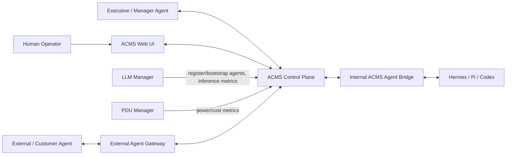
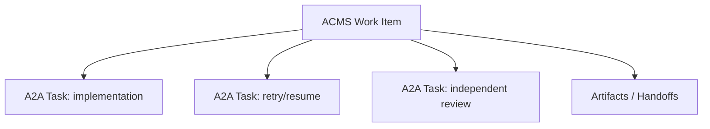
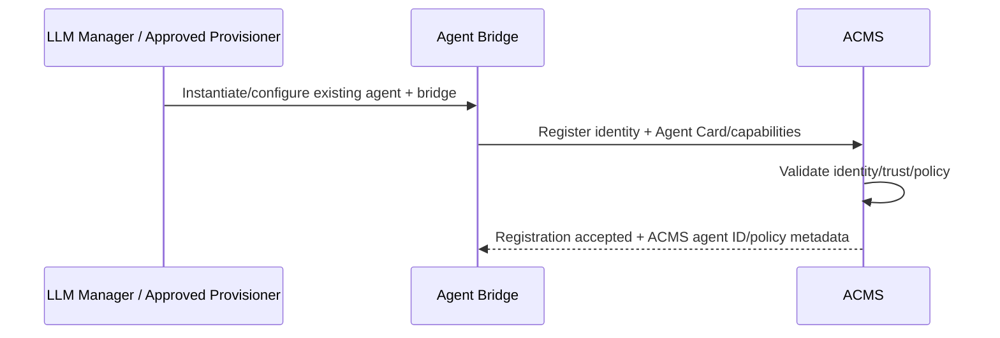
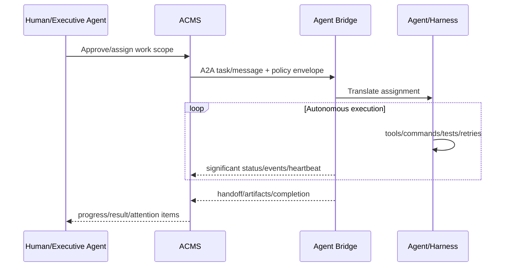
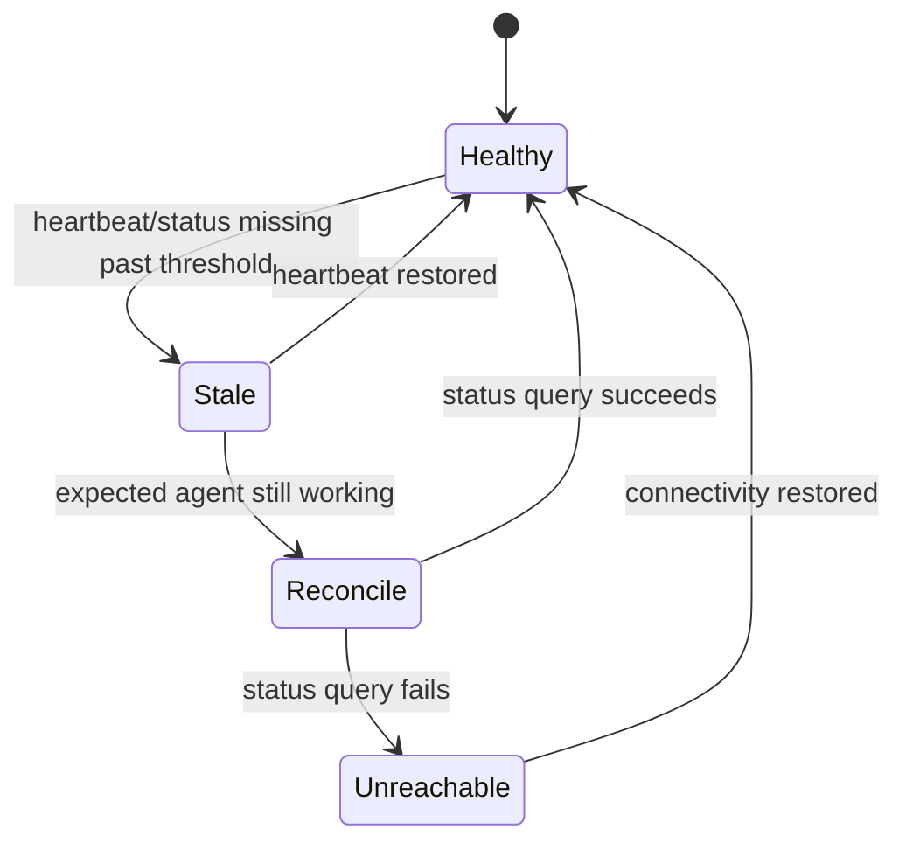
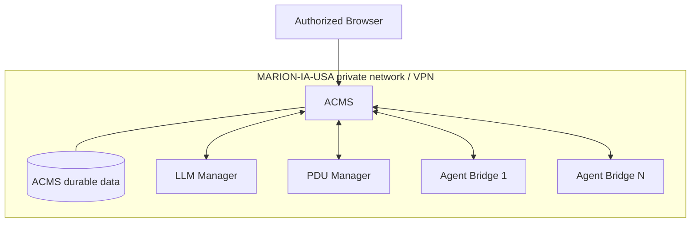
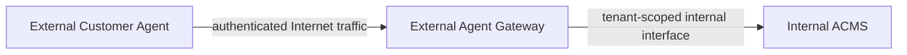

# AgentifyMe Cloud Management System - Architecture

This document records the current architecture intentions for ACMS. It follows the repository's lean arc42/C4 approach and uses Mermaid for diagrams.

## 1. Introduction and Goals

### Purpose

ACMS is the control plane for orchestrating a fleet of registered AI agents. It provides durable work assignment, context governance, human steering, auditability, performance feedback, and cost/status visibility while allowing agents to execute autonomously inside approved boundaries.

ACMS is not the agent-instantiation or model-serving system. LLM Manager owns agent instantiation/bootstrap, model/inference infrastructure, and authoritative inference/cost reporting.

### Architecturally significant requirements

- `ACMS-REQ-002` - orchestration without agent instantiation.
- `ACMS-REQ-003` - standardized Agent Bridge.
- `ACMS-REQ-009` - decentralized execution inside an approved envelope.
- `ACMS-REQ-017` - hierarchical context model.
- `ACMS-REQ-022` - internal/external context isolation.
- `ACMS-REQ-026` - mandatory human approval boundaries.
- `ACMS-REQ-031` - A2A-based communication profile.
- `ACMS-REQ-040` - External Agent Gateway.
- `ACMS-REQ-050` - avoid per-action centralized execution dependency.
- `ACMS-REQ-051` - initial fleet scalability target.

### Quality goals

1. **Human control without approval fatigue.** Governance protects meaningful boundaries while routine reversible execution remains autonomous.
2. **Interoperability.** Hermes, Pi, Codex, and future harnesses fit through one management contract.
3. **Traceability.** Humans can reconstruct what was assigned, what happened, what the agent believed happened, and what artifacts resulted.
4. **Security isolation.** Internal and external/customer trust domains do not mix by default.
5. **Scalability by decentralization.** ACMS does not proxy every shell command/tool invocation.
6. **Repeatability.** Agent identity/configuration and protected context are versioned and lockable.

### Stakeholders

| Stakeholder | Primary concern |
|---|---|
| Startup Teams administrators | Reliable control of the AI workforce, cost, security, and audit. |
| Project/product managers | Direction, scope, progress, blockers, human-attention items. |
| Worker agents | Clear assignment, context, autonomy envelope, reliable control channel. |
| Manager/Executive agents | Delegated authority, task decomposition, workforce coordination. |
| LLM Manager | Clear ownership boundary and machine-readable policy/metric interface. |
| Future AgentifyMe customers | Isolation of their agent/data from internal and other-customer context. |

## 2. Architecture Constraints

- Initial deployment is primarily MARION-IA-USA, but the architecture must not depend on a single location.
- ACMS orchestrates but does not instantiate agents.
- LLM Manager owns model/inference infrastructure and authoritative inference/cost metrics.
- PDU Manager owns authoritative electrical measurements.
- Durable human-facing context is Markdown-first for MVP.
- A2A is the preferred semantic protocol foundation.
- Feature work requires human-reviewed pull requests.
- Customer/external agent traffic must not directly expose the internal ACMS service.

## 3. Context and Scope

### System context

### Trust boundaries

1. **Human/Web boundary:** authenticated human roles: Administrator, Worker, Observer.
2. **Internal agent boundary:** private-network/VPN Agent Bridges; authenticated/authorized despite network locality.
3. **External/customer boundary:** Internet-facing gateway, tenant isolation, stricter policy, no direct internal ACMS exposure.
4. **Infrastructure dependency boundary:** LLM Manager/PDU Manager provide authoritative provisioning/inference/cost information.

## 4. Solution Strategy

### 4.1 Centralized governance, decentralized execution

ACMS is authoritative for approved assignment, scope, budget, context access, trust classification, approvals, and audit. It is **not** authoritative for every local implementation step.

Once assigned work, an agent can execute tools, commands, tests, retries, and local background routines without synchronous permission from ACMS so long as it stays inside the approved envelope.

This prevents ACMS from becoming a throughput bottleneck while preserving management visibility.

### 4.2 A2A-first communication with ACMS extensions

ACMS uses Agent2Agent as the semantic base for task/message/artifact communication. A versioned **ACMS A2A Profile** extends the standard only where ACMS needs orchestration-specific concepts such as heartbeat metadata, primary-assignment identity, background-routine inventory, governance metadata, or additional lifecycle controls.

Do not fork A2A unless a future incompatibility makes it unavoidable. Prefer standards-compatible extensions so future A2A updates remain adoptable.

### 4.3 Standard Agent Bridge

Every managed harness is exposed through a small ACMS Agent Bridge. The bridge:

- presents Agent Card/capability metadata;
- accepts ACMS/A2A commands and messages;
- converts those requests into harness-native operations;
- emits A2A task/status/artifact events;
- emits liveness/heartbeat signals;
- inventories local background routines;
- exposes transcript/handoff references where available;
- isolates ACMS from harness-specific implementation details.

### 4.4 One primary assignment, many background routines

An agent has at most one primary ACMS work assignment. It may independently execute multiple known background routines/cron jobs. ACMS records the routine inventory/latest status but does not schedule or authorize every invocation.

### 4.5 Management work item versus A2A task

An ACMS **Work Item** is a durable management object describing scope, requirements, owner, acceptance, budget, history, and artifacts.

An A2A **Task** is an execution interaction. One ACMS Work Item may map to one or more A2A Tasks because work can be retried, resumed after reboot, peer-reviewed, or executed in multiple phases.

### 4.6 Significant-event durability, not token-stream durability

Live streaming is for situational awareness. The audit/state system durably stores significant semantic events such as assignment, state changes, decisions, errors, approvals, human/agent messages, handoffs, artifacts, budget/scope events, and completion.

Token-by-token SSE fragments are not required as durable events. Raw transcripts and Markdown handoffs provide detailed forensic context.

## 5. Building Block View

| Building block | Responsibility | Primary interfaces |
|---|---|---|
| ACMS Web UI | Human dashboard, work board, agent view, chat/steering, approvals, cost/status | ACMS API + aggregated UI event stream |
| ACMS API / Control Plane | Registry, work, policy, commands, query APIs | Web UI, Agent Bridges, Gateway, LLM/PDU Managers |
| Agent Registry | Persistent identities, versions, trust class, capabilities, bridge/card metadata | ACMS API |
| Work Orchestrator | Projects/features/work items, assignment, task/run relationships | ACMS API, Agent Bridges |
| Context Manager | Hierarchical Markdown-backed context metadata, validity state, access rules | ACMS API |
| Governance/Approval Engine | Roles, budgets, approval rules, timeout/default behavior | ACMS API |
| Audit/Event Store | Significant semantic events and correlations | all control-plane components |
| Human Attention Queue | Co-work/approval/blocker workflow | Web UI, agents |
| Metrics/Cost Adapter | Import/correlate LLM Manager and PDU Manager metrics | external metrics APIs |
| ACMS Agent Bridge | Standardize A2A + harness controls | ACMS <-> harness |
| External Agent Gateway | Internet-facing auth, tenant isolation, protocol mediation | external agents <-> ACMS |

## 6. Runtime View

### 6.1 Agent registration

LLM Manager is responsible for creating/configuring the agent runtime. ACMS begins orchestration after registration.

### 6.2 Work assignment and autonomous execution

### 6.3 Live streaming and reconnect

A2A SSE can carry live task/status/artifact updates. ACMS treats the stream as a live view, not as the only source of truth.

If streaming disconnects:

1. ACMS retains last durable significant event/state.
2. Bridge continues safe authorized local execution when possible.
3. Reconnect/resubscribe obtains current A2A task state and subsequent events.
4. Missing significant state can be reconciled from task status, transcript/handoff, or durable bridge/ACMS events.

### 6.4 Heartbeat/watchdog

Heartbeat is separate from detailed task streaming. It answers "is the registered agent/bridge alive and reporting?" rather than "what token is it generating?"

A fleet-wide reconciliation runs periodically (daily is the initial intention). A working agent may be actively queried sooner, for example after a configurable interval such as an hour without expected contact.

### 6.5 Human approval timeout

Approval classes:

- **Reversible in-scope:** checkpoint/preserve state, use documented fallback assumption, continue.
- **Consequential but deferable:** defer the action, continue unrelated authorized work, batch for co-work.
- **Mandatory human gate:** do not execute the gated action on timeout; continue only unrelated authorized work.

## 7. Deployment View

### Initial internal deployment

Internal bridge endpoints are private-network/VPN endpoints. Public exposure is not required.

### Future external deployment

The gateway is separately deployable and is the only intended Internet-facing agent-control boundary.

## 8. Cross-Cutting Concepts

### Authentication and authorization

MVP requires authenticated/authorized agent and human operations. Exact credentials/identity mechanism should be selected in a reviewed implementation ADR.

**mTLS (mutual TLS)** is a possible stronger future mechanism. Normal TLS usually proves the server's identity to the client. With mTLS, **both sides present certificates and verify each other**, so ACMS can cryptographically authenticate the Agent Bridge and the bridge can authenticate ACMS at the transport layer. It is powerful for machine-to-machine identity but adds certificate issuance, rotation, revocation, expiry, and operational complexity. It is therefore a Priority 2 security enhancement unless the implementation review concludes it is necessary for MVP.

### Context authorization

Organization/Product/Project/Feature context is protected. External agents are tenant-scoped and cannot receive internal organization or unrelated customer context by default.

### Audit/event correlation

Significant events carry actor, timestamp, target, event type, and sequence/correlation identity where practical. This supports reconnect/reconciliation without storing every token fragment.

### Cost boundaries

LLM Manager and PDU Manager are authoritative producers. ACMS consumes and correlates metrics; it does not independently reproduce infrastructure-cost calculations.

### Agent improvement

Performance evidence includes human feedback, independent peer review, scope adherence, execution outcomes, and cost. Recommendations may propose agent/model/context changes. Locked agent versions and protected context are not silently rewritten.

## 9. Architecture Decisions

Human-directed decisions from discovery should be recorded as Accepted ADRs:

- ADR-0001 - Markdown and Mermaid for architecture documentation.
- ADR-0002 - Centralized governance with decentralized agent execution.
- ADR-0003 - A2A-first agent communication through a standardized Agent Bridge.
- ADR-0004 - Separate ACMS orchestration from LLM Manager instantiation/inference ownership.
- ADR-0005 - Separate internal and external/customer agent trust paths.
- ADR-0006 - Preserve significant semantic events while treating token streaming as ephemeral.

The exact implementation stack and MVP authentication mechanism remain to be approved in the first implementation PR/ADR.

## 10. Quality Requirements

| Requirement | Attribute | Target |
|---|---|---|
| ACMS-REQ-037 | Responsiveness | Healthy internal steering accepted within 30 seconds. |
| ACMS-REQ-051 | Scalability | At least 100 concurrently active agents without per-agent browser connections or constant polling. |
| ACMS-REQ-022 | Isolation | External agents do not receive internal/unrelated tenant context by default. |
| ACMS-REQ-026 | Governance | Mandatory gated action does not auto-approve on timeout. |
| ACMS-REQ-035 | Auditability | Significant state transitions are reconstructable from durable semantic events. |

## 11. Risks and Technical Debt

| Risk | Impact | Mitigation |
|---|---|---|
| A2A standard evolves quickly | Protocol churn | Use standards-compatible ACMS extension/profile and versioned Agent Cards rather than a fork. |
| Harnesses have inconsistent controls | UI/runtime mismatch | Agent Bridge capability advertisement; never assume unsupported actions. |
| ACMS becomes central execution bottleneck | Limits autonomy/scale | Keep low-level execution local; ingest significant events/heartbeats only. |
| Approval fatigue | Humans bypass controls | Batch deferable decisions; default only mandatory gates to hold/deny. |
| Context leakage to customer agents | Severe confidentiality risk | Separate trust class, tenant scope, protected context, External Agent Gateway. |
| Excess telemetry volume | DB/UI bottleneck | Persist semantic events, not token noise; add event bus later if measured need appears. |
| Agent/version drift | Non-repeatable workflows | Version and lock agent identity/configuration and protected context. |

## 12. Glossary

| Term | Definition |
|---|---|
| ACMS | AgentifyMe Cloud Management System. |
| Agent Bridge | Standard wrapper translating ACMS/A2A operations to a specific harness. |
| Agent Card | A2A capability/discovery description for an agent endpoint. |
| Work Item | Durable ACMS management record for approved work. |
| A2A Task | Stateful execution interaction in the Agent2Agent protocol. |
| Executive Agent | Standard ACMS agent given broad explicitly delegated authority to act as a human surrogate. |
| Primary Assignment | The one main ACMS work item currently assigned to a worker agent. |
| Background Routine | Known autonomous cron/scheduled/local routine that does not replace the primary assignment. |
| Protected Context | Organization, Product, Project, and Feature context requiring human authorization/delegation for modification. |
| Semantic Event | Significant state/action/audit event retained durably, unlike token-level stream fragments. |
